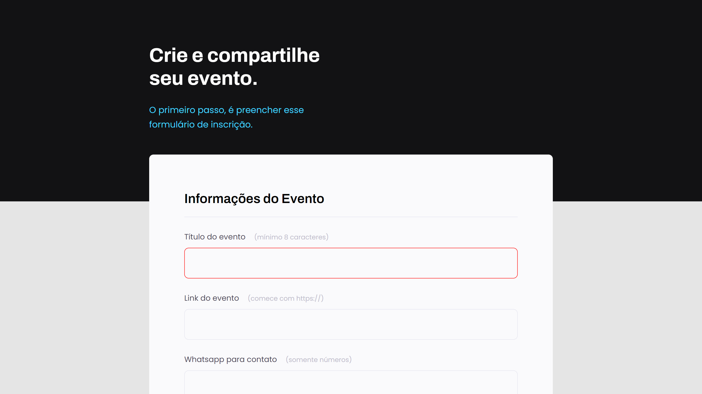
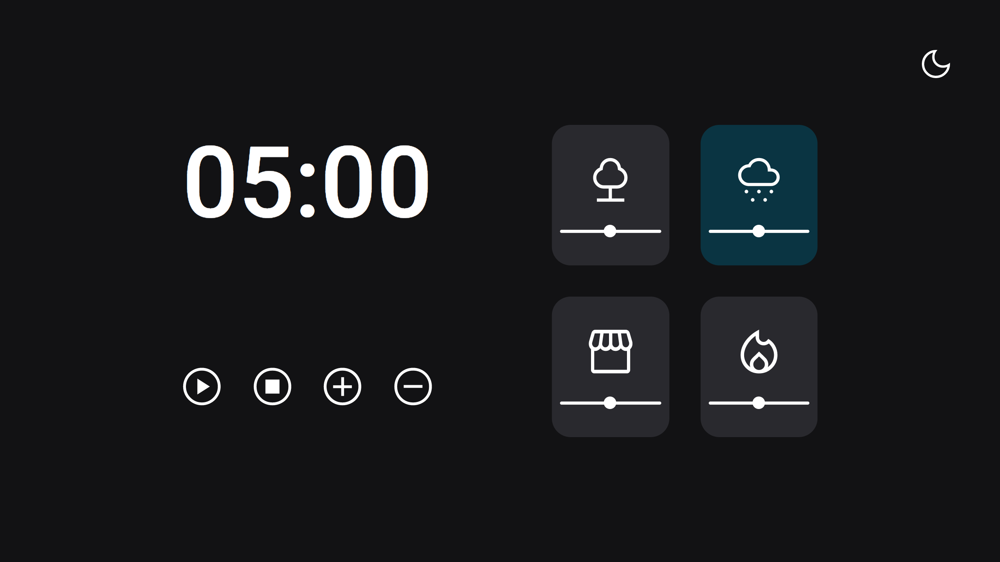

<h1>Rocketseat Explorer 🚀</h1>

This is a repository created to organize the practical projects of Rockeseat's Explorer program, class 10.

Below is an index of projects developed with source code and live with GitHub Pages.

    Rocketseat Explorer Projects | Class 10 
    <a href="https://www.rocketseat.com.br/explorer" target="_blank">Learn more about the program by clicking here</a> 
     <table>
     <table style="width: 100%">
    <thead>
      <tr>
        <th align="center">
          
          

            <small>#</small>
          

        </th>
        <th align="center">
          
          

            <small>
                NAME
            </small>
          

        </th>
        <th align="left">
          
          

            <small>
            LEVEL
            </small>
          

        </th>
        <th align="left">
          
          

            <small>
            SOURCE CODE
            </small>
          

        </th>
        <th align="center">
          
          

            <small>
            LIVE
            </small>
          

        </th>
      </tr>
    </thead>
    <tbody>
      <tr>
        <td>01</td>
        <td>Project 01</td>
        <td align="left">2</td>
        <td>
          <a href="https://github.com/leonardojacomussi/rocketseat-explorer/tree/main/project-01" target="_blank">
            /project-01
          </a>
        </td>
        <td align="center">
        </td>
      </tr>
      <tr>
        <td>02</td>
        <td>Project 01 Extra</td>
        <td align="left">2</td>
        <td>
          <a href="https://github.com/leonardojacomussi/rocketseat-explorer/tree/main/project-01-extra" target="_blank">
            /project-01-extra
          </a>
        </td>
        <td align="center">
        </td>
      </tr>
      <tr>
        <td>03</td>
        <td>Project 02</td>
        <td align="left">2</td>
        <td>
          <a href="https://github.com/leonardojacomussi/rocketseat-explorer/tree/main/project-02" target="_blank">
            /project-02
          </a>
        </td>
        <td align="center">
        </td>
      </tr>
      <tr>
        <td>04</td>
        <td>Project 02 Extra</td>
        <td align="left">2</td>
        <td>
          <a href="https://github.com/leonardojacomussi/rocketseat-explorer/tree/main/project-02-extra" target="_blank">
            /project-02
          </a>
        </td>
        <td align="center">
        </td>
      </tr>
      <tr>
        <td>05</td>
        <td>Project 03</td>
        <td align="left">3</td>
        <td>
          <a href="https://github.com/leonardojacomussi/rocketseat-explorer/tree/main/project-03" target="_blank">
            /project-03
          </a>
        </td>
        <td align="center">
        </td>
      </tr>
      <tr>
        <td>06</td>
        <td>Project 03 - Challenge 01</td>
        <td align="left">3</td>
        <td>
          <a href="https://github.com/leonardojacomussi/rocketseat-explorer/tree/main/project-03/challenge-01" target="_blank">
            /project-03/challenge-01
          </a>
        </td>
        <td align="center">
        </td>
      </tr>
      <tr>
        <td>07</td>
        <td>Project 03 - Challenge 02</td>
        <td align="left">3</td>
        <td>
          <a href="https://github.com/leonardojacomussi/rocketseat-explorer/tree/main/project-03/challenge-02" target="_blank">
            /project-03/challenge-02
          </a>
        </td>
        <td align="center">
        </td>
      </tr>
      <tr>
        <td>08</td>
        <td>Project 04</td>
        <td align="left">3</td>
        <td>
          <a href="https://github.com/leonardojacomussi/rocketseat-explorer/tree/main/project-04" target="_blank">
            /project-04
          </a>
        </td>
        <td align="center">
        </td>
      </tr>
      <tr>
        <td>09</td>
        <td>Project 05</td>
        <td align="left">3</td>
        <td>
          <a href="https://github.com/leonardojacomussi/rocketseat-explorer/tree/main/project-05" target="_blank">
            /project-05
          </a>
        </td>
        <td align="center">
        </td>
      </tr>
      <tr>
        <td>10</td>
        <td>Project 05 - Challenge 02</td>
        <td align="left">3</td>
        <td>
          <a href="https://github.com/leonardojacomussi/rocketseat-explorer/tree/main/project-05/challenge-02" target="_blank">
            /project-05/challenge-02
          </a>
        </td>
        <td align="center">
          
        </td>
      </tr>
      <tr>
        <td>11</td>
        <td>Project 05 - Challenge 01</td>
        <td align="left">3</td>
        <td>
          <a href="https://github.com/leonardojacomussi/rocketseat-explorer/tree/main/project-05/challenge-03" target="_blank">
            /project-05/challenge-03
          </a>
        </td>
        <td align="center">
          
        </td>
      </tr>
      <tr>
        <td>12</td>
        <td>Cheesecake</td>
        <td align="left">3</td>
        <td>
          <a href="https://github.com/leonardojacomussi/rocketseat-explorer/tree/main/cheesecake" target="_blank">
            /cheesecake
          </a>
        </td>
        <td align="center">
          
        </td>
      </tr>
      <tr>
        <td>13</td>
        <td>Galaxies</td>
        <td align="left">3</td>
        <td>
          <a href="https://github.com/leonardojacomussi/rocketseat-explorer/tree/main/galaxies" target="_blank">
            /galaxies
          </a>
        </td>
        <td align="center">
          
        </td>
      </tr>
      <tr>
        <td>14</td>
        <td>Jogo da Adivinhação</td>
        <td align="left">5</td>
        <td>
          <a href="https://github.com/leonardojacomussi/rocketseat-explorer/tree/main/jogo-da-adivinhacao" target="_blank">
            /jogo-da-adivinhacao
          </a>
        </td>
        <td align="center">
          
        </td>
      </tr>
      <tr>
        <td>15</td>
        <td>Biscoito da Sorte</td>
        <td align="left">5</td>
        <td>
          <a href="https://github.com/leonardojacomussi/rocketseat-explorer/tree/main/biscoito-da-sorte" target="_blank">
            /biscoito-da-sorte
          </a>
        </td>
        <td align="center">
          
        </td>
      </tr>
      <tr>
        <td>16</td>
        <td>Calculadora de IMC</td>
        <td align="left">5</td>
        <td>
          <a href="https://github.com/leonardojacomussi/rocketseat-explorer/tree/main/calculadora-de-imc" target="_blank">
            /calculadora-de-imc
          </a>
        </td>
        <td align="center">
          
        </td>
      </tr>
      <tr>
        <td>17</td>
        <td>Project 06</td>
        <td align="left">5</td>
        <td>
          <a href="https://github.com/leonardojacomussi/rocketseat-explorer/tree/main/project-06" target="_blank">
            /project-06
          </a>
        </td>
        <td align="center">
          
        </td>
      </tr>
      <tr>
        <td>18</td>
        <td>Project 06 - Challenge 01</td>
        <td align="left">5</td>
        <td>
          <a href="https://github.com/leonardojacomussi/rocketseat-explorer/tree/main/project-06/challenge-01" target="_blank">
            /project-06/challenge-01
          </a>
        </td>
        <td align="center">
          
        </td>
      </tr>
      <tr>
        <td>19</td>
        <td>Project 06 - Challenge 02</td>
        <td align="left">5</td>
        <td>
          <a href="https://github.com/leonardojacomussi/rocketseat-explorer/tree/main/project-06/challenge-02" target="_blank">
            /project-06/challenge-02
          </a>
        </td>
        <td align="center">
          
        </td>
      </tr>
      <tr>
        <td>20</td>
        <td>SPA Universe</td>
        <td align="left">6</td>
        <td>
          <a href="https://github.com/leonardojacomussi/rocketseat-explorer/tree/main/spa-universe" target="_blank">
            /spa-universe
          </a>
        </td>
        <td align="center">
          
        </td>
      </tr>
      <tr>
        <td>21</td>
        <td>GitHub Favorites</td>
        <td align="left">6</td>
        <td>
          <a href="https://github.com/leonardojacomussi/rocketseat-explorer/tree/main/github-favorites" target="_blank">
            /github-favorites
          </a>
        </td>
        <td align="center">
          
        </td>
      </tr>
      <tr>
        <td>22</td>
        <td>GitFav</td>
        <td align="left">6</td>
        <td>
          <a href="https://github.com/leonardojacomussi/rocketseat-explorer/tree/main/gitfav" target="_blank">
            /gitfav
          </a>
        </td>
        <td align="center">
          
        </td>
      </tr>
    </tbody>
</table>

<h1>Live 👁️‍🗨️</h1>
This repository is hosted on GitHub Pages via the following link: <a href="https://leonardojacomussi.github.io/rocketseat-explorer/" target="_blank">https://leonardojacomussi.github.io/rocketseat-explorer/</a>

 
 

---
Note: <strong style="color: #643cbb">README.md</strong> inspired by <a href="https://github.com/maykbrito/boracodar" target="_blank">https://github.com/maykbrito/boracodar</a>
