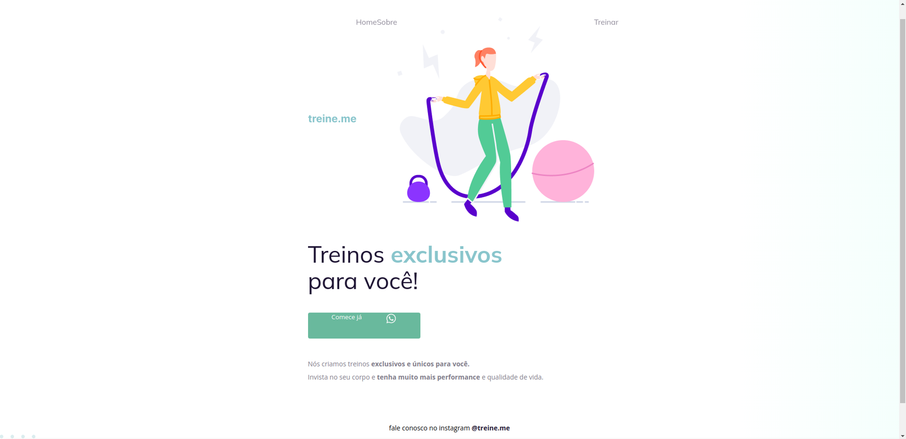

### [Back](https://github.com/leonardojacomussi/rocketseat-explorer/tree/main/project-02)[⬅️](https://github.com/leonardojacomussi/rocketseat-explorer/tree/main/project-02)

<h1 align="center"> Challenge 01 </h1>

Challenge 01 proposed to fix HTML and CSS bugs in the Project 02 files.

Click <strong>[here](https://efficient-sloth-d85.notion.site/Iniciante-Corrigindo-bugs-02-300452b6901e4197b7c6fd291a280acf)</strong> to access the original files with bugs and challenge instructions.

<h2> Before </h2>

 

<h2> After </h2>

---
Note: access <strong style="color: #643cbb">[Project 02](https://github.com/leonardojacomussi/rocketseat-explorer/tree/main/project-02)</strong> for more information.
