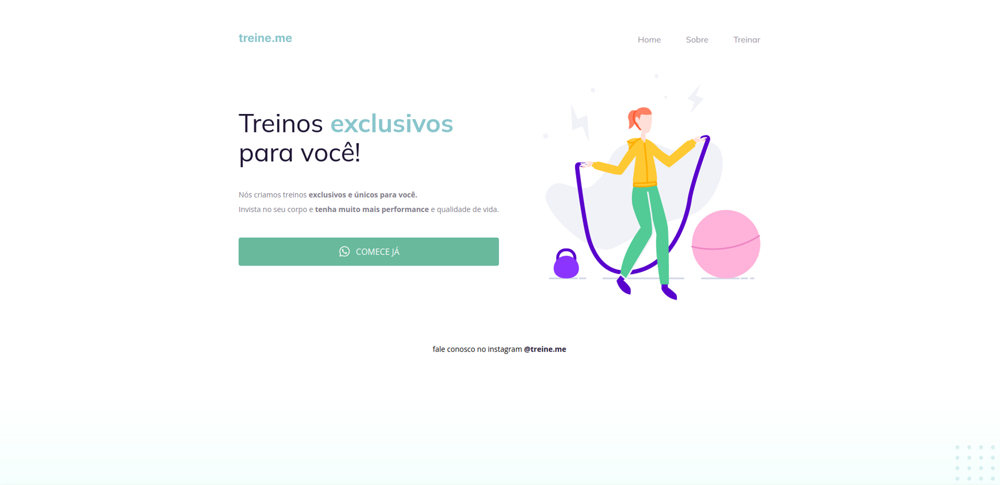
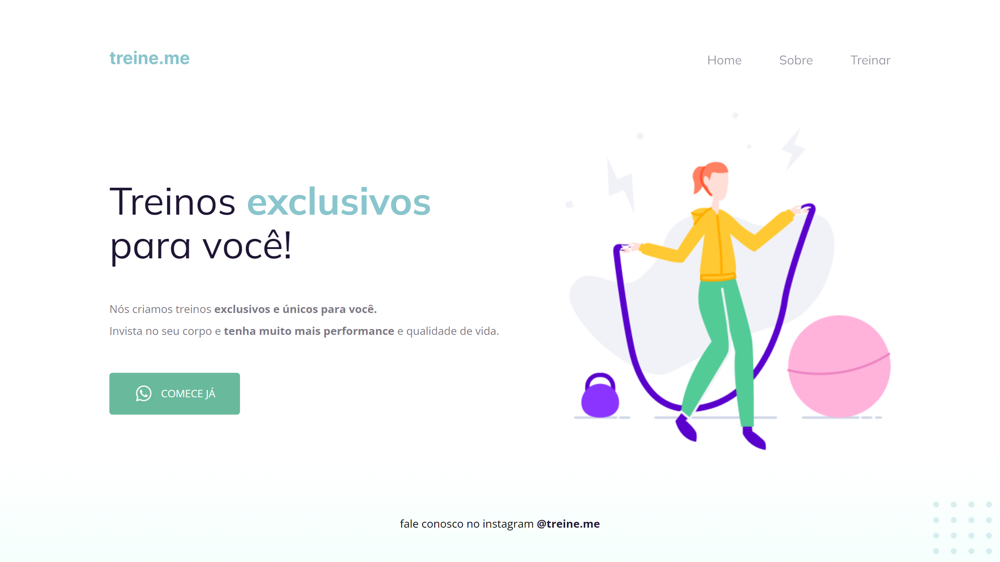

### [Back](https://github.com/leonardojacomussi/rocketseat-explorer/tree/main/project-02)[⬅️](https://github.com/leonardojacomussi/rocketseat-explorer/tree/main/project-02)

<h1 align="center"> Challenge 02 </h1>

Challenge 02 proposed to correct the semantics of the HTML tags and adjust the CSS selectors accordingly in the Project 02 files, for better accessibility.

Click <strong>[here](https://efficient-sloth-d85.notion.site/Intermedi-rio-Sem-ntica-e-acessibilidade-849b1ec224c349e3854a20aed395a45f)</strong> to access the original files with bugs and challenge instructions.

<h2> Before </h2>

 

<h2> After </h2>

---
Note: access <strong style="color: #643cbb">[Project 02](https://github.com/leonardojacomussi/rocketseat-explorer/tree/main/project-02)</strong> for more information.
