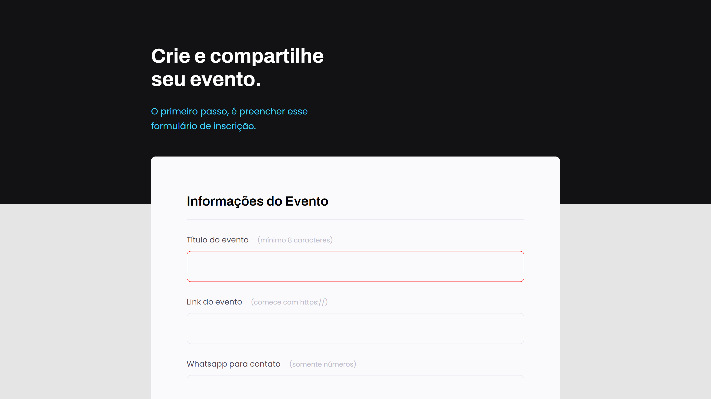

### [Back](https://github.com/leonardojacomussi/rocketseat-explorer)[⬅️](https://github.com/leonardojacomussi/rocketseat-explorer)

<h1 align="center"> Project 03 </h1>

Explorer is a complete program that brings together all that is needed to develop technical and behavioral skills, with monitoring by a qualified team from Rocketseat, to achieve the first position in the programming market.  

  <a href="#preview">Preview</a>&nbsp;&nbsp;&nbsp;|&nbsp;&nbsp;&nbsp;
  <a href="#technologies">Technologies</a>&nbsp;&nbsp;&nbsp;|&nbsp;&nbsp;&nbsp;
  <a href="#layout">Layout</a>&nbsp;&nbsp;&nbsp;|&nbsp;&nbsp;&nbsp;
  <a href="#license">License</a>

  

 

  

<h2 id="preview">👁️‍🗨️ Preview</h2>

This project is hosted at Github Pages of this repository by the link <a href="https://leonardojacomussi.github.io/rocketseat-explorer/project-03" target="_blank">https://leonardojacomussi.github.io/rocketseat-explorer/project-03</a>

<h2 id="technologies">🚀 Technologies</h2>

This project was developed with the following technologies:

- HTML and CSS
- Git and Github
- Figma

<h2 id="layout">🔖 Layout</h2>

You can view the project layout through [THIS LINK](https://www.figma.com/file/ZqRmErD95oI1F90VA79wis/Explorer-Stage-03-Projeto-01-(Copy)). You must have a [Figma](https://figma.com) account to access it.

<h2 id="license">📜 License</h2>

This project is under the MIT license.

---
Note: <strong style="color: #643cbb">README.md</strong> inspired by <a href="https://github.com/maykbrito/boracodar/tree/main/01" target="_blank">https://github.com/maykbrito/boracodar/tree/main/01</a>
