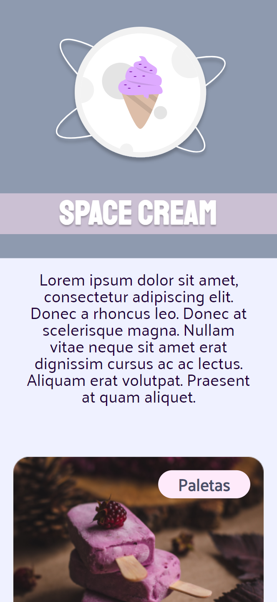

### [Back](https://github.com/leonardojacomussi/rocketseat-explorer/tree/main/project-05)[⬅️](https://github.com/leonardojacomussi/rocketseat-explorer/tree/main/project-05)

<h1 align="center"> Challenge 01 </h1>

Challenge 01 is met by running a layout in Figma with the following concepts:

- Mobile First;
- Flexible measuring unit;
- Variables;
- Simple animations.

Click <strong>[here](https://efficient-sloth-d85.notion.site/Mobile-first-3355d7df0aa24efcb4287f69b3859928)</strong> to access the challenge instructions.

<h2> Live </h2>

This challenge is hosted at Github Pages of this repository by the link <a href="https://leonardojacomussi.github.io/rocketseat-explorer/project-05/challenge-01/" target="_blank">https://leonardojacomussi.github.io/rocketseat-explorer/project-05/challenge-01/</a>

  

---
Note: access <strong style="color: #643cbb">[Project 05](https://github.com/leonardojacomussi/rocketseat-explorer/tree/main/project-05)</strong>.
