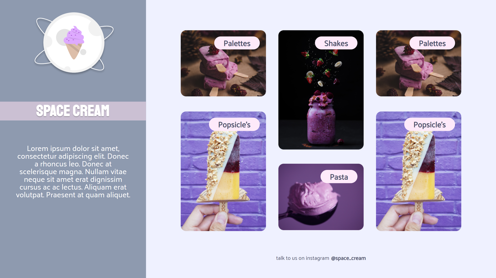

### [Back](https://github.com/leonardojacomussi/rocketseat-explorer/tree/main/project-05)[⬅️](https://github.com/leonardojacomussi/rocketseat-explorer/tree/main/project-05)

<h1 align="center"> Challenge 02 </h1>

Challenge 02 proposed to run the mobile version of challenge 01 (see [here](../challenge-01/)).

Click <strong>[here](https://efficient-sloth-d85.notion.site/Grid-com-anima-es-5ea8b6051189446ebcda9914f7ac4dc9)</strong> to access the challenge instructions.

<h2> Preview </h2>

This challenge is hosted at Github Pages of this repository by the link <a href="https://leonardojacomussi.github.io/rocketseat-explorer/project-05/challenge-02/" target="_blank">https://leonardojacomussi.github.io/rocketseat-explorer/project-05/challenge-02/</a>

<table>
  <tbody>
    <tr>
      <td>
        
      </td>
      <td>
        
      </td>
    </tr>
  </tbody>
</table>

---
Note: access <strong style="color: #643cbb">[Project 05](https://github.com/leonardojacomussi/rocketseat-explorer/tree/main/project-05)</strong>.
