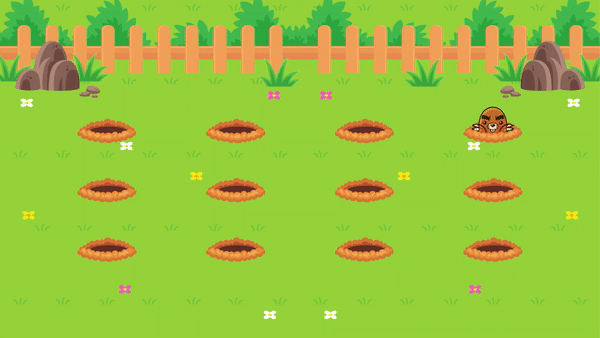

### [Back](https://github.com/leonardojacomussi/rocketseat-explorer/tree/main/project-05)[⬅️](https://github.com/leonardojacomussi/rocketseat-explorer/tree/main/project-05)

<h1 align="center"> Challenge 03 </h1>

In challenge 03 it was proposed to create animations with keyframes in CSS to make the moles appear in the field.

Click <strong>[here](https://efficient-sloth-d85.notion.site/Jardim-das-toupeiras-anima-es-com-keyframes-Opcional-2c949711f082453ab8949633f56e4a01)</strong> to access the challenge instructions.

<h2> Live </h2>

This challenge is hosted at Github Pages of this repository by the link <a href="https://leonardojacomussi.github.io/rocketseat-explorer/project-05/challenge-03/" target="_blank">https://leonardojacomussi.github.io/rocketseat-explorer/project-05/challenge-03/</a>

---
Note: access <strong style="color: #643cbb">[Project 05](https://github.com/leonardojacomussi/rocketseat-explorer/tree/main/project-05)</strong>.
