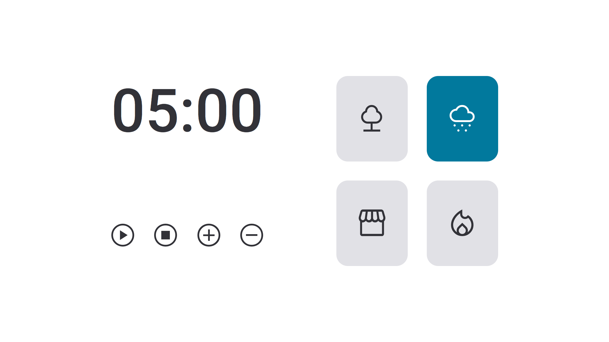

### [Back](https://github.com/leonardojacomussi/rocketseat-explorer/tree/main/project-05)[⬅️](https://github.com/leonardojacomussi/rocketseat-explorer/tree/main/project-06)

<h1 align="center"> Challenge 01 </h1>

Challenge 01 proposed the implementation of version 2.0 of Project 06 (FocusTimer), with new features and a different layout.

Click <strong>[here](https://efficient-sloth-d85.notion.site/FocusTimer-Vers-o-2-0-2e273fa9212a432eae6b51dda3c69594)</strong> to access the challenge instructions.

<h2> Live </h2>

This challenge is hosted at Github Pages of this repository by the link <a href="https://leonardojacomussi.github.io/rocketseat-explorer/project-06/challenge-01/" target="_blank">https://leonardojacomussi.github.io/rocketseat-explorer/project-06/challenge-01/</a>

  

---
Note: access <strong style="color: #643cbb">[Project 05](https://github.com/leonardojacomussi/rocketseat-explorer/tree/main/project-06)</strong>.
