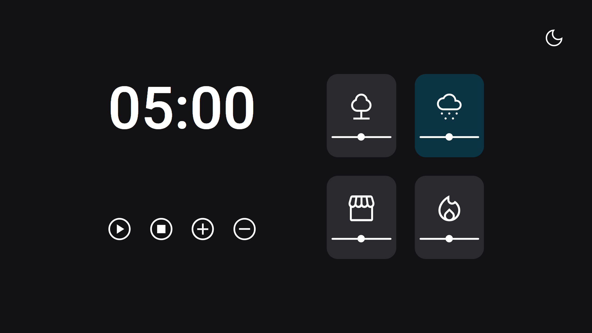

### [Back](https://github.com/leonardojacomussi/rocketseat-explorer/tree/main/project-06)[⬅️](https://github.com/leonardojacomussi/rocketseat-explorer/tree/main/project-06)

<h1 align="center"> Challenge 02 </h1>

Challenge 02 proposed to implement from version 2.0 of Project 06 (FocusTime) new functionalities such as audio volume control and theme selector (light/dark).

Click <strong>[here](https://efficient-sloth-d85.notion.site/FocusTimer-Dark-Mode-df7a74c5bcb745a0be5428897eb79b3e)</strong> to access the challenge instructions.

<h2> Live </h2>

This challenge is hosted at Github Pages of this repository by the link <a href="https://leonardojacomussi.github.io/rocketseat-explorer/project-06/challenge-02/" target="_blank">https://leonardojacomussi.github.io/rocketseat-explorer/project-06/challenge-02/</a>

  

---
Note: access <strong style="color: #643cbb">[Project 06](https://github.com/leonardojacomussi/rocketseat-explorer/tree/main/project-06)</strong>.
